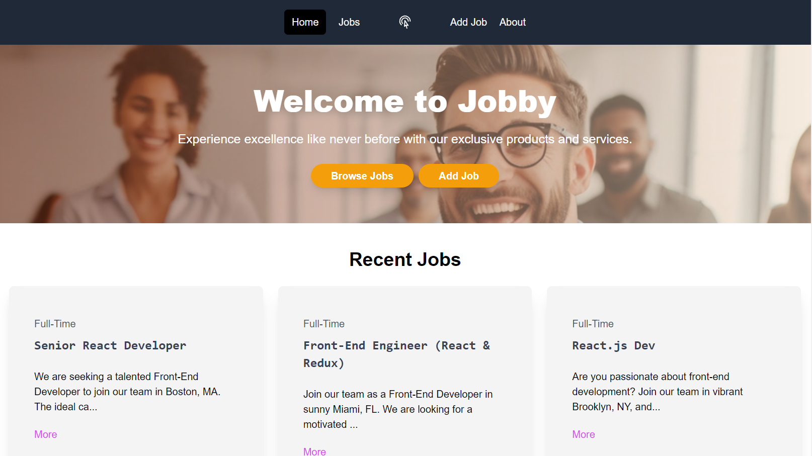
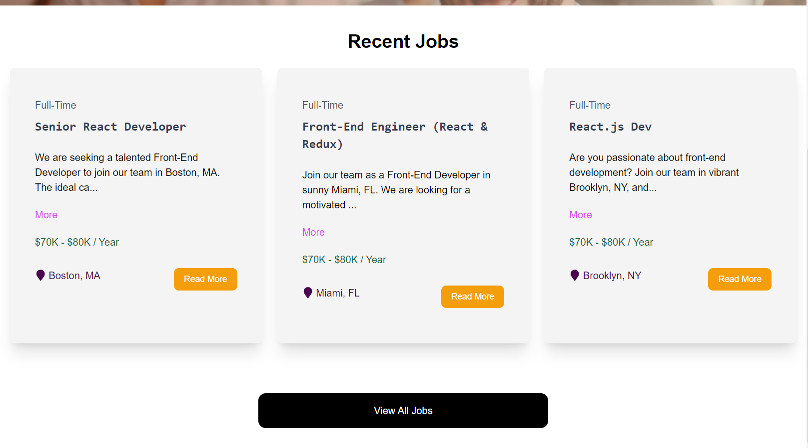

# Jobby - Job Board Listing
Jobby is a job board website designed to revolutionize the way job seekers find opportunities and employers post vacancies. Leveraging modern web technologies, Jobby offers a seamless and intuitive platform for users to search, apply, and manage job listings. With a focus on user experience and customization, Jobby provides employers with the tools to create tailored job boards that attract the right talent. Whether you're a job seeker looking for your next career move or an employer seeking to fill open positions, Jobby is your go-to platform for all your job board needs.


<br/>


## Technology Used: <br/>
Vite <br/>
React <br/>
Tailwind CSS <br/>
JSON Server <br/>

## Usage

This project uses JSON-Server for a mock backend.

### Install Dependencies

```bash
npm install
```

### Run JSON Server

The server will run on http://localhost:8000

```bash
npm run server
```

### Run Vite Frontend

React will run on http://localhost:3000

```bash
npm run dev
```

### Build for Production

```bash
npm run build
```

### Preview Production Build

```bash
npm run preview
```


Acknowledgement:

Super thanks to this guide: https://www.youtube.com/watch?v=LDB4uaJ87e0
